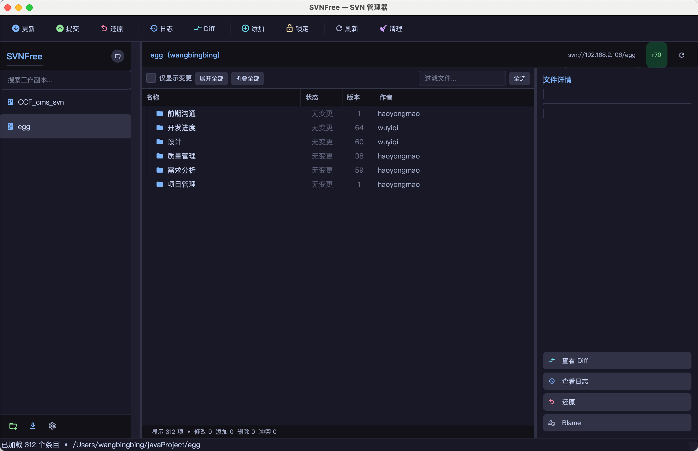

# SVNFree 用户手册

> SVNFree 是一款 **macOS 原生 SVN 图形客户端**，基于 Python + PyQt6 开发，提供简洁易用的深色主题界面，支持完整的 SVN 工作副本管理功能，并深度集成 macOS 。

---

## 目录

- [系统要求](#系统要求)
- [安装与启动](#安装与启动)
- [界面概览](#界面概览)
- [核心功能](#核心功能)
  - [添加工作副本](#添加工作副本)
  - [检出仓库](#检出仓库)
  - [更新工作副本](#更新工作副本)
  - [提交变更](#提交变更)
  - [查看文件差异](#查看文件差异)
  - [查看提交日志](#查看提交日志)
  - [还原本地修改](#还原本地修改)
  - [添加文件到版本控制](#添加文件到版本控制)
  - [删除文件](#删除文件)
  - [文件锁定与解锁](#文件锁定与解锁)
  - [Blame 逐行追溯](#blame-逐行追溯)
  - [SVN 属性管理](#svn-属性管理)
  - [清理工作副本](#清理工作副本)
- [认证管理](#认证管理)
- [文件状态说明](#文件状态说明)
- [配置文件位置](#配置文件位置)
- [从源码运行](#从源码运行)
- [打包为 App](#打包为-app)
- [常见问题](#常见问题)

---

## 系统要求

| 项目 | 要求 |
|------|------|
| 操作系统 | macOS 11.0（Big Sur）及以上 |
| SVN 客户端 | 需预先安装 `subversion`（推荐通过 Homebrew 安装） |
| Python（源码运行） | Python 3.10+ |

**安装 SVN（如果尚未安装）：**

```bash
# 通过 Homebrew 安装
brew install subversion
```

SVNFree 启动时会自动检测以下路径是否存在 svn 命令：
- `/opt/homebrew/bin/svn`（Apple Silicon Mac）
- `/usr/local/bin/svn`（Intel Mac）
- `/usr/bin/svn`（系统自带）

若未检测到 svn，启动时会弹出安装引导对话框。

---

## 安装与启动

### 方式一：使用已打包的 App（推荐）

直接运行 `dist/SVNFree.app`，双击即可启动。

### 方式二：从源码运行

```bash
# 克隆或进入项目目录
cd /path/to/svnFree

# 使用启动脚本（自动创建虚拟环境并安装依赖）
bash run.sh
```

`run.sh` 会自动：
1. 检测是否已存在虚拟环境 `venv/`
2. 若不存在则自动创建并安装 `requirements.txt` 中的所有依赖
3. 启动主程序

---

## 界面概览



应用启动后会在 macOS **系统托盘**（菜单栏右侧）显示 SVN 图标，右键可快速显示主窗口或退出。

---

## 核心功能

### 添加工作副本

将已有的本地 SVN 工作副本添加到 SVNFree 管理列表。

**操作方式：**
- 点击左侧边栏顶部的 **`+`** 按钮
- 或点击底部的 **`添加`** 按钮
- 或菜单 **仓库 → 添加工作副本**

在弹出的目录选择对话框中，选择本地已有的 SVN 工作副本目录即可。

> **提示：** 添加后的工作副本会持久保存，下次启动 SVNFree 时自动恢复。

---

### 检出仓库

从 SVN 服务器检出一个新的工作副本到本地。

**操作方式：**
- 点击左侧边栏底部的 **`检出`** 按钮
- 或菜单 **仓库 → 检出**

**检出对话框参数：**

| 参数 | 说明 |
|------|------|
| 仓库 URL | SVN 仓库地址，如 `svn://example.com/repo` 或 `https://...` |
| 本地路径 | 检出到本地的目标目录，点击 `...` 按钮选择目录 |
| 版本号 | 默认 `HEAD`（最新版本），可填写具体版本号 |
| 检出深度 | `infinity`（全部）/ `immediates`（仅直属子项）/ `files`（仅文件）/ `empty`（仅目录本身） |

检出过程中实时显示进度日志。检出成功后，工作副本会自动添加到左侧边栏。

---

### 更新工作副本

将工作副本更新到服务器最新版本或指定版本。

**操作方式：**
- 工具栏点击 **`更新`** 按钮
- 或菜单 **工作副本 → 更新**
- 或在文件树右键菜单选择 **`更新`**

可在更新对话框中指定目标版本号，留空则更新到 `HEAD`。更新过程中实时显示日志输出。

---

### 提交变更

将本地修改提交到 SVN 服务器。

**操作方式：**
- 工具栏点击 **`提交`** 按钮
- 或菜单 **工作副本 → 提交**
- 或在文件树中勾选文件后点击提交

**提交对话框：**
- 上方填写**提交说明**（commit message），支持多行
- 下方列出所有变更文件，默认全选
- 可通过复选框选择性提交部分文件
- 支持 **全选 / 取消全选** 快捷按钮
- 点击 **`提交`** 开始提交，过程中按钮变灰防止重复点击

> **注意：** 提交说明为必填项，空说明可能被服务器拒绝（取决于服务器钩子配置）。

---

### 查看文件差异

查看文件相对于版本库的修改内容，带语法高亮。

**操作方式：**
- 工具栏点击 **`Diff`** 按钮
- 在文件树中**双击文件**
- 右键菜单选择 **`查看 Diff`**
- 在详情面板点击 **`Diff`** 按钮

**Diff 查看器颜色说明：**

| 颜色 | 含义 |
|------|------|
| 绿色背景 | 新增的行（`+`） |
| 红色背景 | 删除的行（`-`） |
| 蓝色加粗 | 文件头信息（`+++` / `---`） |
| 紫色加粗 | 代码块头（`@@`） |
| 灰色 | 元数据行（`Index:`） |

工具栏显示 `+N -N` 统计新增和删除的行数。

---

### 查看提交日志

查看文件或整个工作副本的历史提交记录。

**操作方式：**
- 工具栏点击 **`日志`** 按钮
- 右键菜单选择 **`查看日志`**
- 在详情面板点击 **`日志`** 按钮

**日志对话框功能：**
- 日志列表显示：版本号 / 作者 / 日期 / 提交说明
- 可调节加载条数（10 ~ 1000 条，步进 50）
- 点击日志条目，下方显示该次提交的详细说明和变更文件列表
- **双击变更文件列表中的文件** → 查看该文件在该次提交中的 Diff
- 点击 **`查看本次 Diff`** → 查看整个提交的完整 Diff

---

### 还原本地修改

放弃本地修改，将文件还原到版本库中的状态。

**操作方式：**
- 工具栏点击 **`还原`** 按钮
- 右键菜单选择 **`还原`**
- 在详情面板点击 **`还原`** 按钮

> **警告：** 还原操作**不可撤销**，本地未提交的修改将永久丢失，请谨慎操作。

---

### 添加文件到版本控制

将未版本控制（`unversioned`）的文件加入 SVN 管理。

**操作方式：**
- 工具栏点击 **`添加`** 按钮
- 右键菜单选择 **`添加`**

文件添加后状态变为 `added`，下次提交时会上传到服务器。

---

### 删除文件

从版本控制中删除文件（同时从工作副本中移除）。

**操作方式：**
- 右键菜单选择 **`删除`**

删除后文件状态变为 `deleted`，下次提交时会同步删除服务器上的文件。

---

### 文件锁定与解锁

对文件加锁，防止其他用户同时修改（适用于二进制文件等不可合并的文件类型）。

**操作方式：**
- 工具栏点击 **`锁定`** 按钮（选中文件后）
- 右键菜单选择 **`锁定`** 或 **`解锁`**

---

### Blame 逐行追溯

查看文件每一行最后由哪个用户、在哪个版本修改的。

**操作方式：**
- 右键菜单选择 **`Blame`**
- 在详情面板点击 **`Blame`** 按钮

---

### SVN 属性管理

查看和编辑文件或目录的 SVN 属性（如 `svn:ignore`、`svn:eol-style`、`svn:keywords` 等）。

**操作方式：**
- 右键菜单选择 **`属性`**

**属性对话框功能：**
- 列出当前文件/目录的所有 SVN 属性和值
- 点击属性行查看完整属性值
- 支持添加新属性（填写属性名和值后点击 **`添加`**）
- 支持删除选中的属性

---

### 清理工作副本

当工作副本因异常中断（如网络断开、强制退出）导致锁定或状态异常时，使用清理功能恢复正常状态。

**操作方式：**
- 工具栏点击 **`清理`** 按钮
- 右键菜单选择 **`清理`**

---

## 认证管理

当 SVN 操作需要身份验证时，SVNFree 会**自动弹出认证对话框**，填写用户名和密码即可。

**认证选项：**
- **允许 SVN 记住此凭证**：勾选后，凭证会保存到 `~/.subversion/auth/` 目录，下次操作无需重复输入

**管理已缓存的凭证：**

菜单 **仓库 → 管理凭证** 可打开凭证管理对话框：
- 列出所有已缓存的 SVN 认证凭证（域名 + 用户名）
- 支持选中单条凭证后点击 **`清除选中`** 删除
- 点击 **`清除全部`** 删除所有已缓存凭证
- 当前仓库对应的凭证会高亮显示在列表顶部

---
## 文件状态说明

工作副本文件树中，每个文件的状态列显示当前的 SVN 状态：

| 状态 | 颜色 | 说明 |
|------|------|------|
| `normal` | 白色 | 文件未修改，与版本库一致 |
| `modified` | 绿色 | 文件内容有本地修改 |
| `added` | 青色 | 已标记为新增，等待提交 |
| `deleted` | 红色 | 已标记为删除，等待提交 |
| `conflicted` | 橙色 | 更新时产生冲突，需手动解决 |
| `unversioned` | 灰色 | 文件不在版本控制下 |
| `missing` | 红色 | 文件在版本控制下但本地已丢失 |
| `replaced` | 紫色 | 文件被替换（先删除再添加） |
| `ignored` | 灰色 | 被 `svn:ignore` 忽略的文件 |
| `external` | 蓝色 | 来自 `svn:externals` 的外部引用 |
| `obstructed` | 橙色 | 期望是目录但实际是文件，或反之 |

**过滤功能：**
- 勾选 **`仅显示变更`** 复选框，可快速过滤出所有有变更的文件
- 在搜索框中输入关键词，可按文件名实时过滤

---

## 配置文件位置

| 文件 | 路径 | 说明 |
|------|------|------|
| 工作副本列表 | `~/.svnfree/repos.json` | 保存所有已添加的工作副本信息 |
| SVN 认证缓存 | `~/.subversion/auth/` | SVN 标准认证信息存储目录 |
| SVN 全局配置 | `~/.subversion/config` | SVN 客户端全局配置文件 |

---

## 从源码运行

### 环境要求

- Python 3.10+
- macOS 系统（依赖 macOS FSEvents 文件监控）

### 安装依赖

```bash
cd /path/to/svnFree

# 创建虚拟环境
python3 -m venv venv
source venv/bin/activate

# 安装依赖
pip install -r requirements.txt
```

### 启动

```bash
# 方式一：使用启动脚本（推荐）
bash run.sh

# 方式二：手动激活虚拟环境后运行
source venv/bin/activate
python svn_manager/main.py
```

### 主要依赖说明

| 依赖包 | 版本 | 用途 |
|--------|------|------|
| PyQt6 | 6.10.2 | GUI 框架 |
| QtAwesome | 1.4.1 | 矢量图标（FontAwesome 6 + Material Design Icons） |
| watchdog | 6.0.0 | 文件系统监控（自动刷新） |
| Pillow | 12.1.1 | 图像处理 |
| PyInstaller | 6.19.0 | 打包为 App（可选） |

---

## 打包为 App

使用 PyInstaller 将项目打包为独立的 macOS App：

```bash
# 激活虚拟环境
source venv/bin/activate

# 执行打包
pyinstaller SVNFree.spec
```

打包完成后，`dist/SVNFree.app` 即为可直接分发的 macOS 应用，无需安装 Python 环境。

---

## 常见问题

### Q: 启动时提示"未找到 svn 命令"？

**A:** 需要先安装 SVN 命令行工具：
```bash
brew install subversion
```
安装后重启 SVNFree 即可。

---

### Q: 添加工作副本时提示"不是有效的 SVN 工作副本"？

**A:** 所选目录必须是已经通过 `svn checkout` 检出的工作副本（目录下包含 `.svn` 隐藏文件夹）。若尚未检出，请使用 **`检出`** 功能先从服务器检出。

---

### Q: 提交时弹出认证对话框，输入正确密码后仍然失败？

**A:** 请尝试以下步骤：
1. 在 **仓库 → 管理凭证** 中清除该仓库的缓存凭证
2. 重新执行操作，在弹出的认证对话框中输入用户名和密码
3. 确保勾选 **`允许 SVN 记住此凭证`** 以保存凭证

---

### Q: 工作副本文件状态不更新？

**A:** SVNFree 使用文件系统监控（watchdog）自动检测变更，具有 0.8 秒防抖延迟。若状态显示不正确，可点击工具栏的 **`刷新`** 按钮手动刷新。

---

### Q: 工作副本出现"locked"错误无法操作？

**A:** 点击工具栏的 **`清理`** 按钮执行 `svn cleanup` 操作，可清除工作副本中的锁定状态。

---

*SVNFree v1.0.0 | 基于 Python + PyQt6 开发 | 仅支持 macOS*