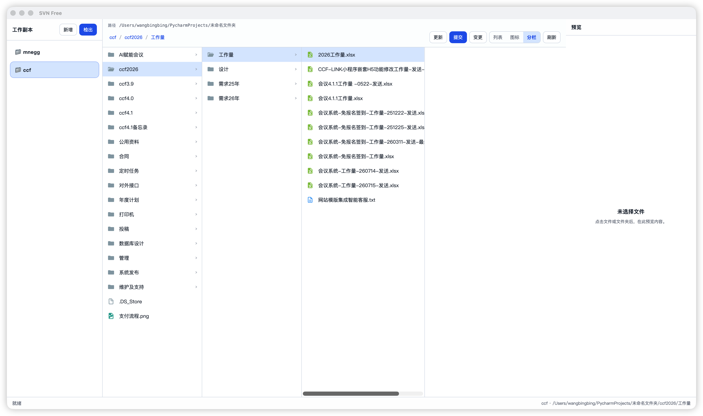

# SVN Free

基于 **Tauri 2 + Vue 3 + TypeScript** 的 macOS SVN 图形客户端。  
直接调用本机 `svn` 命令，管理本地工作副本、浏览文件、查看差异、提交与还原。

## 效果展示



主界面采用三栏布局：

- 左侧：工作副本列表
- 中间：文件浏览（默认分栏视图）
- 右侧：文件预览

## 功能特性

### 工作副本管理
- 添加已有本地 SVN 工作副本
- 从远程地址检出（`svn checkout`）
- 工作副本重命名、从列表移除（不删除本地文件）
- 一键更新 / 提交 / 查看变更

### 文件浏览
- 列表 / 图标 / **分栏** 三种视图（默认分栏）
- 面包屑导航，双击进入目录
- 显示 SVN 状态：`M` `A` `D` `?` `C` `!` 等
- 支持多选（`⌘` / `Shift`）
- 文本、代码、图片预览

### SVN 操作
- 提交：遍历选中文件夹与文件的变更，勾选后提交
- 更新、还原（原生确认弹窗）
- 添加到版本控制 / 忽略
- DIFF 对比（分栏 / 统一视图）
- 日志、Blame、属性、补丁导出
- 锁定 / 解锁、Clean、Switch
- 在 Finder 中显示

### 变更与安全
- 本地变更列表快速浏览
- 未纳入版本控制（`?`）的项不提供还原
- 还原前强制确认，避免误操作

## 环境要求

- macOS 10.15+
- Node.js 18+
- Rust（用于 Tauri 构建）
- Subversion CLI

```bash
brew install svn
svn --version
```

## 快速开始

```bash
# 安装依赖
npm install

# 开发模式
npm run tauri dev
```

## 打包

```bash
npm run tauri build
```

常见产物路径：

```text
src-tauri/target/release/bundle/macos/SVN Free.app
src-tauri/target/release/bundle/dmg/SVN Free_0.1.0_aarch64.dmg
```

仓库已附带 macOS Apple Silicon 安装包：

```text
release/SVN Free_0.1.0_aarch64.dmg
```

下载地址：  
[release/SVN Free_0.1.0_aarch64.dmg](./release/SVN%20Free_0.1.0_aarch64.dmg)

## 技术栈

- 前端：Vue 3、TypeScript、Vite
- 桌面：Tauri 2
- 后端：Rust（调用本机 `svn`）
- 图标：Material Icon Theme

## 数据存储

工作副本列表保存在：

```text
~/Library/Application Support/svn-free/workspaces.json
```

## 使用提示

1. 先安装并确认本机 `svn` 可用：`svn --version`
2. 左侧添加已有工作副本，或执行检出
3. 中间浏览文件，右侧预览内容
4. 右键菜单可完成大部分 SVN 操作
5. 多选文件/文件夹后提交，会汇总各自范围内的变更供勾选

## 仓库

- GitHub：[https://github.com/1456745460/svnFree](https://github.com/1456745460/svnFree)
- 克隆：

```bash
git clone git@github.com:1456745460/svnFree.git
cd svnFree
npm install
npm run tauri dev
```

## 版本

当前版本：`0.1.0`

## License

个人项目，按需使用。
